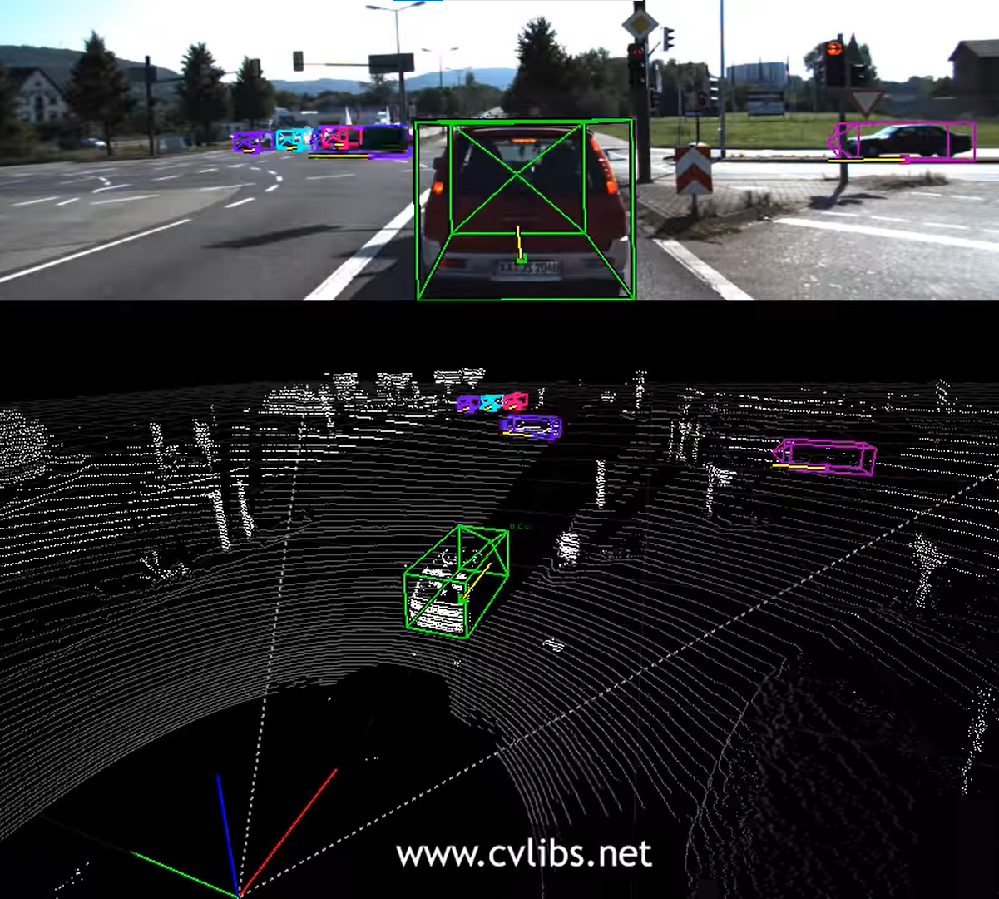
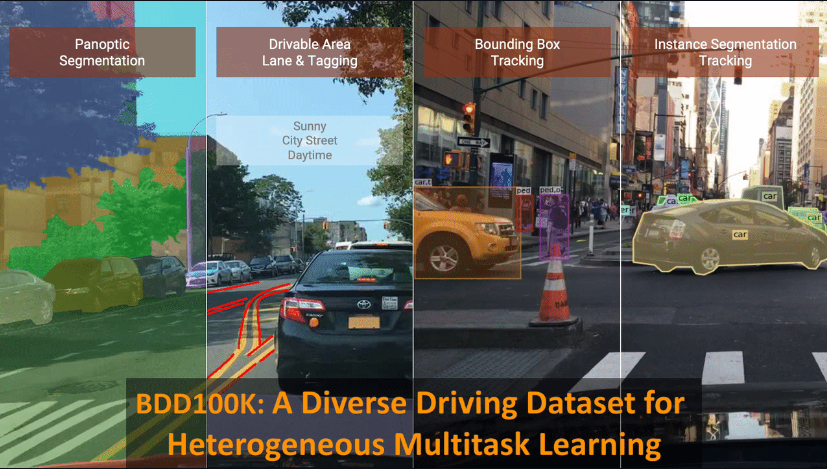
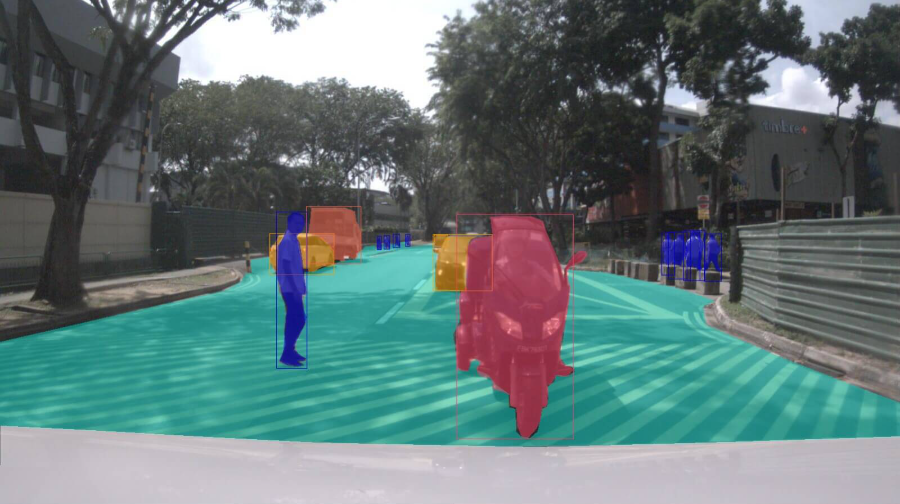
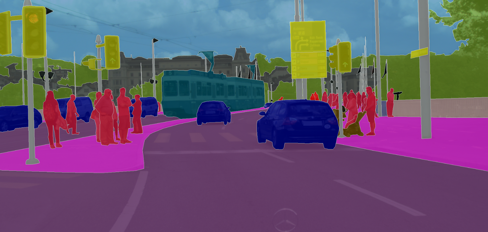
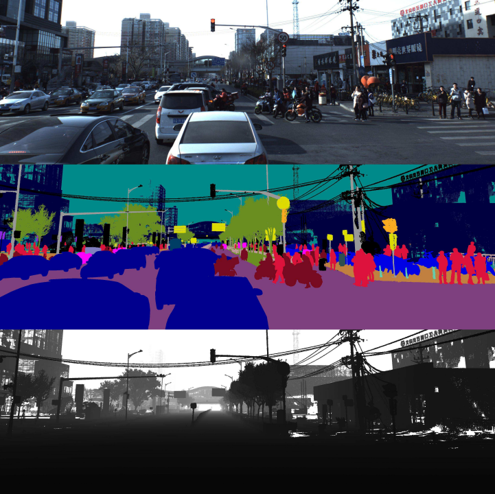
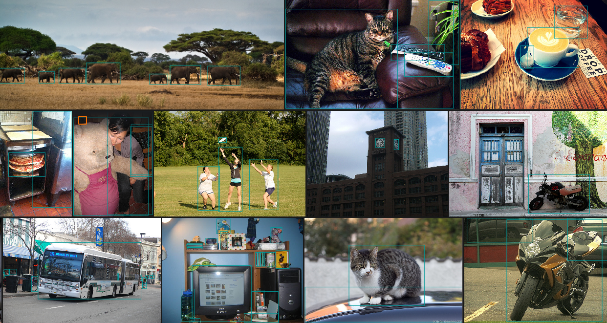

# Datasets For Active Learning

The aim of this document is to collect some of available datasets to use in the project, and provide an overview of them.

## Datasets

1) [KITTI](#kitti)
2) [Berkley Deep Drive (BDD100k)](#berkley-deep-drive-bdd100k)
3) [nuImages](#nuimages)
4) [Cityscape](#cityscrape)
5) [ApolloScape](#apolloscape)
6) [MS Coco](#ms_coco)

### KITTI

https://www.youtube.com/watch?v=KXpZ6B1YB_k
- Dataset: 
    - https://www.cvlibs.net/datasets/kitti/

- Description:
    - KITTI is a large dataset which focuses on stereo, visual odomentry, 3d object detection and tracking. 
    It has videos and continous data from the sensors.

- Data types:
    - Video
    - GPS
    - Lidar
    - 3D GPS

- Annotation types:
    - Pixel level semantic classes
    - 2D and 3D bounding boxes
    - object detection only in [KITTI MoSeg](http://webdocs.cs.ualberta.ca/~vis/kittimoseg/)

- API:
    - [Voxel51](https://docs.voxel51.com)
    - [Tensorflow](https://www.tensorflow.org/datasets/catalog/kitti)
    - [Torchvision](http://pytorch.org/vision/main/generated/torchvision.datasets.Kitti.html)

### Berkley Deep Drive (Bdd100k)

- Dataset: 
    - https://arxiv.org/abs/1805.04687
    - https://github.com/bdd100k/bdd100k

- Description: 
    - The Bdd100k contains 100k videos which all are 40 seconds long. The data has variaty in the context of weather, geography, time of day and enviroments. 

- Data types:
    - Video
    - Lidar

- Annotation types:
     - Scene tagging
     - Bounding boxes
     - Lane marking
     - Drivable area
     - Semantic and instance segmentation
     - Object tracking

- API:
    - [Voxel51](https://docs.voxel51.com)
    - [BDD100K toolkit](https://doc.bdd100k.com/usage.html)

### nuImages

- Dataset: 
    - https://www.nuscenes.org/nuimages

- Description:
    - nuImages contains labeled 1000 scenes (nuScenes) and 93k 2Hz videos which are 13 frames long.

- Data types:
    - Video
    - Lidar

- Annotation types:
    - 2D and 3D bounding boxes
    - Semantic segmentation
    - Drivable area

- API:
    - [nuimages](https://colab.research.google.com/github/nutonomy/nuscenes-devkit/blob/master/python-sdk/tutorials/nuimages_tutorial.ipynb)

### Cityscape

- Dataset:
    - https://www.cityscapes-dataset.com

- Description:
    - The Cityscape dataset contins around 5k images with fine annotation (instances individually) and aroung 20k images with coarse annotation (semantic classes + polygon over individulal instances). It has divesity in time of day, time of season, weather condition and enviroments.

- Data type:
    - Images

- Annotation types:
    - Semantic segmentation
    - Instance segmentation

- API:
    - [cityscapesscripts](https://pypi.org/project/cityscapesScripts/)
    - [Voxel51](https://docs.voxel51.com)

### ApolloScape

- Dataset: 
    - https://apolloscape.auto/index.html

- Description:
    - The Apolloscape dataset aims for semantic segmentation. It is much larger and has more labels than Cityscape and Kitti. It contatins more than 143k images annotated on the pixel level.

- Data types:
    - Videos
    - Lidar    

- Annotation types:
    - 3D Point clouds
    - Semantic segmentation

### MS_COCO

- Dataset:
    - https://cocodataset.org/#home

- Description: 
    - MS COCO contains images of common items in context. This dataset aims for advances in object recognition in the context of scene understanding.

- Data type:
    - Images

- Annotation types:
    - Bounding boxes
    - Semantic segmentation
    - Instace-level segmentation

- Add-ons:
    - https://cocodataset.org/#external

- API:
    - [Voxel51](https://docs.voxel51.com)
